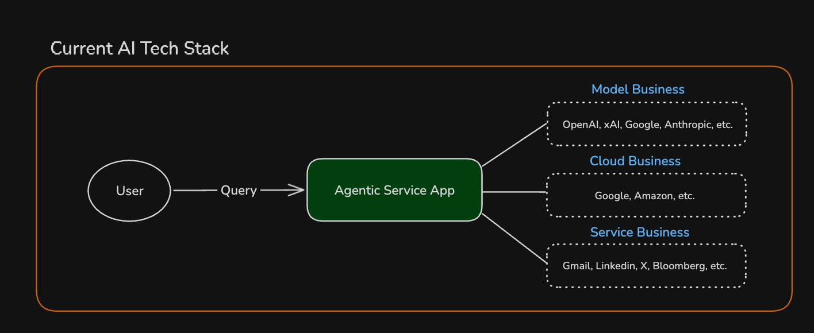
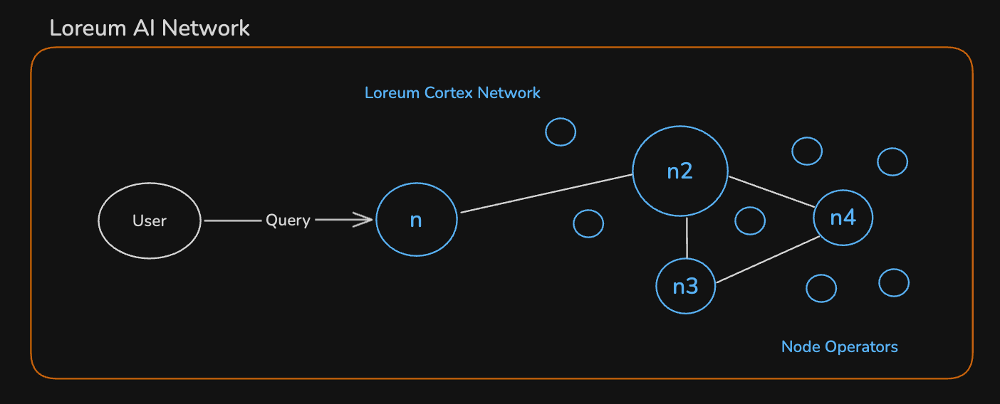
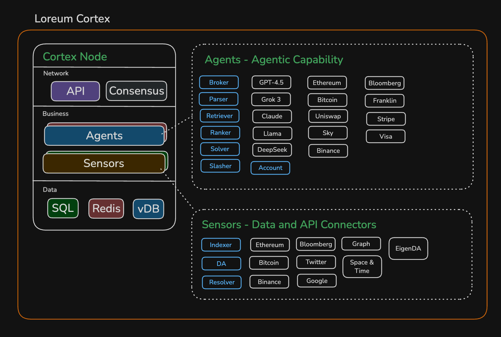

# Loreum Architecture

## Introduction

This document provides an overview of the Loreum architecture, from the current technological context to Loreum's innovative decentralized design. We'll explore how Loreum transforms traditional AI infrastructure into a distributed, scalable network.

## Current AI Infrastructure

### Traditional Architecture

The current AI technology stack relies heavily on centralized infrastructure:

#### Query Flow
1. User submits query to Agentic Service App
2. App processes and routes to appropriate providers
3. Response aggregated and returned to user

This architecture uses a middleware pattern to abstract provider interactions and handle request routing, with dependencies on external AI, cloud, and data services.

## The Loreum Network

### Overview

Loreum transforms the traditional centralized architecture into a decentralized system where interconnected nodes collaborate to process queries efficiently.

### Network Architecture

#### Query Flow
1. User submits query to entry node (n)
2. Query routed through Loreum Cortex Network
3. Distributed processing across node network (n2, n3, n4)

#### Network Structure
- Decentralized P2P node network
- Dynamic workload distribution
- Specialized node capabilities
- Horizontal scaling via node addition

#### Technical Properties
- Asynchronous inter-node communication
- Independent node operation

## The Loreum Cortex

### Overview

The Loreum Cortex is the core node architecture within the Loreum AI Network, providing the foundation for distributed AI computation.

### Node Structure

#### 1. Network Layer
- **API**: Facilitates external interactions and node communication
- **Consensus**: Manages node agreement through DAG-based consensus
- **Broker**: Handles request routing and distribution

#### 2. Business Layer

##### Agents
AI-powered modules that process queries and execute functions:
- **Core Agents**:
  - Broker: Manages request distribution
  - Parser: Processes incoming queries
  - Retriever: Fetches relevant data
  - Ranker: Prioritizes responses
  - Solver: Handles the verification of query intent
  - Slasher: Handles penalty mechanisms
  - Account: Manages user/node accounting

- **Elective Agentic Capabilities**: 
  Node operators can customize their nodes with unique combinations of:
  - AI Models (e.g. GPT-4.5, Grok 3, Claude, Llama, DeepSeek)
  - Blockchain Services (e.g. Ethereum, Bitcoin, Uniswap, Sky, Binance) 
  - Financial Services (e.g. Bloomberg, Franklin, Stripe, Visa)
  
  This flexibility allows each node to specialize in different capabilities, creating a diverse and resilient network where nodes complement each other's strengths.

##### Sensors
Data ingestion and processing modules:
- **Core Components**:
  - Indexer: Manages data indexing
  - DA: Ensures data availability
  - Resolver: Handles data dependencies

- **Data Sources**:
  - Blockchain Networks (Ethereum, Bitcoin, Binance)
  - Financial Data (Bloomberg)
  - Social Media (Twitter)
  - Search Engines (Google)
  - Graph Databases
  - Space & Time
  - EigenDA

#### 3. Data Layer
- **SQL**: Structured data storage for persistent information
- **Redis**: High-speed caching for quick data retrieval
- **vDB**: Vector database for AI operations and RAG capabilities

## Key Features

### Modular Design
- Extensible architecture
- Easy integration of new agents and sensors
- Flexible component configuration

### Advanced Integration
- Multiple AI model support
- Comprehensive financial service integration
- Diverse data source connectivity
- Real-time processing capabilities

### Efficient Data Handling
- Multi-layer storage architecture
- Optimized data retrieval
- Vector-based AI operations
- RAG-enabled query processing

## Technical Benefits

1. **Scalability**
   - Horizontal scaling through node addition
   - Dynamic workload distribution
   - Efficient resource utilization

2. **Reliability**
   - No single point of failure
   - Distributed processing
   - Fault-tolerant architecture

3. **Flexibility**
   - Modular component design
   - Extensible architecture
   - Multiple integration options

4. **Security**
   - Consensus-based validation
   - Distributed trust model
   - Privacy-preserving computation

## Conclusion

The Loreum architecture represents a significant advancement in AI infrastructure, combining the power of distributed systems with sophisticated AI capabilities. Through its modular design, comprehensive integration options, and robust technical foundation, Loreum enables the next generation of decentralized AI applications.

