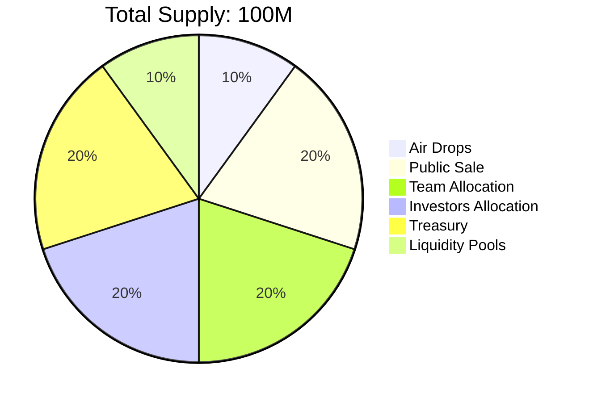
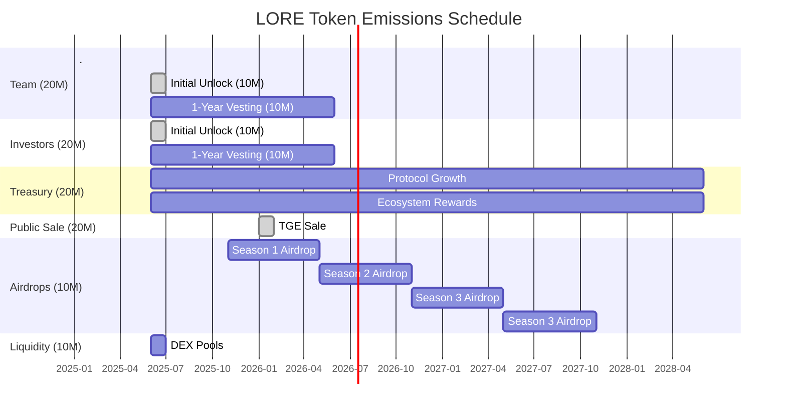

# Loreum Tokenomics
## Allocation Breakdown

## Token Distribution

- **Total Supply**: 100,000,000 LORE
- **Team Allocation**: 20,000,000 LORE (20%)
- **Investors Allocation**: 20,000,000 LORE (20%)
- **Treasury**: 20,000,000 LORE (20%)
- **Liquidity Pools**: 10,000,000 LORE (10%)
- **Public Distribution**: 20,000,000 LORE (20%)
  - Airdrops: 10,000,000 LORE (10%) 
  - TGE Sale: 10,000,000 LORE (10%)

### Team Allocation (20%)
Allocated to the founding team, developers, and key contributors. Vesting schedules may apply to ensure long-term alignment with the project.

### Investors Allocation (20%)
Reserved for seed, private, and strategic investors. These tokens are typically distributed based on funding rounds.

### Treasury (20%)
Reserved for protocol growth, ecosystem development, and long-term sustainability of the network.

### Liquidity Pools (10%)
Designated for decentralized exchange (DEX) liquidity to facilitate smooth token trading and minimize slippage.

### Public Distribution (30%)
Distributed through:
- **Airdrops**: 10% Designed to incentivize early community members and adopters.
- **TGE Sale**: 20% Token sales conducted to raise capital and promote widespread token adoption.

## Token Utility

- **Staking**: $LORE Tokens can be staked in Loreum Nodes for $veLORE to earn protocol rewards and participate in governance.
- **Governance**: $veLORE holders whom staked $LORE into Loreum Nodes can participate in DAO governance, voting on proposals and decisions that shape the ecosystem.
- **Incentives**: Used to reward active contributors, participants, and developers.
- **Market Transactions**: Facilitates transactions within the Loreum ecosystem, including marketplace activities or fee payments.

## Vesting Schedule

- **Team Tokens**: 50% fungible, 50% vested over 12 months.
- **Investor Tokens**: 50% fungible, 50% vested over 12 months.
- **Airdrops**: Distributed gradually in Seasons to avoid market disruption.

This tokenomics structure ensures fair distribution, long-term project sustainability, and alignment with the community and stakeholders.
